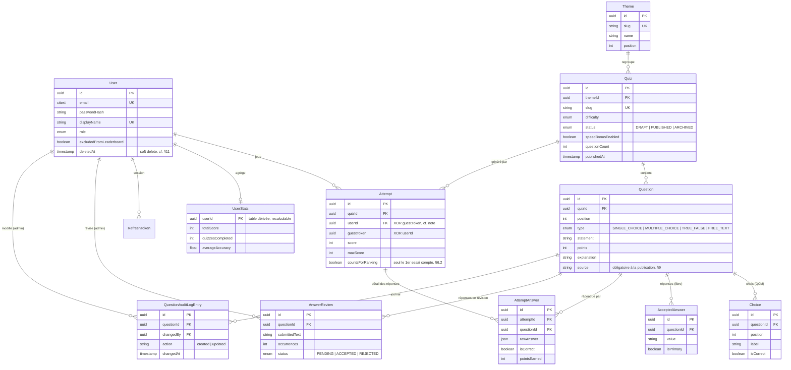

# Quiz Histoire de France

Application de quiz sur l'histoire de France. Le corpus initial porte sur la période napoléonienne (Consulat et Empire, 1799-1815).

Un visiteur anonyme peut jouer immédiatement à n'importe quel quiz publié. Un utilisateur inscrit voit en plus son historique, ses statistiques et sa position dans un classement global. Un administrateur gère le catalogue de quiz et de questions via un back-office dédié.

## Sommaire

- [Stack technique](#stack-technique)
- [Prérequis](#prérequis)
- [Installation](#installation)
- [Variables d'environnement](#variables-denvironnement)
- [Commandes](#commandes)
- [Modèle de données](#modèle-de-données)
- [Décisions d'architecture](#décisions-darchitecture)
- [Tests](#tests)
- [CI](#ci)
- [Structure du dépôt](#structure-du-dépôt)

## Stack technique

**Monorepo** pnpm workspaces : `apps/web` (front), `apps/api` (back), `packages/shared` (types + schémas Zod partagés).

|         |                                                                                                                                       |
| ------- | ------------------------------------------------------------------------------------------------------------------------------------- |
| Front   | Vue 3 (Composition API, `<script setup>`), Vite, Vue Router, Pinia (état client), Pinia Colada (état serveur), Tailwind CSS, vue-i18n |
| Back    | NestJS, PostgreSQL, Prisma (driver adapter `@prisma/adapter-pg`), Zod (`nestjs-zod`), Passport JWT                                    |
| Partagé | Zod (schémas de validation + types inférés, consommés en front et en back)                                                            |
| Tests   | Vitest + Vue Test Utils (unitaire front), Jest + Supertest (unitaire et intégration back), Playwright (E2E)                           |
| Qualité | ESLint (flat config), Prettier, TypeScript strict                                                                                     |

## Prérequis

- Node.js ≥ 20
- [pnpm](https://pnpm.io/) via Corepack (`corepack enable`)
- Docker (pour PostgreSQL en local)

## Installation

```bash
corepack enable
pnpm install

cp .env.example .env
cp .env.example apps/api/.env   # DATABASE_URL et secrets JWT lus ici par l'API
cp .env.example apps/web/.env   # VITE_API_BASE_URL lu ici par le front

docker compose up -d            # PostgreSQL sur le port 5433 (cf. .env.example)
pnpm db:migrate
pnpm db:seed                    # thème + quiz napoléoniens, en DRAFT (cf. § Décisions)

pnpm dev                        # API sur :3000, front sur :5173
```

L'admin s'attribue manuellement en base (aucune route API ne le permet, par choix — voir Décisions) :

```sql
UPDATE users SET role = 'ADMIN' WHERE email = '...';
```

## Variables d'environnement

Voir [`.env.example`](./.env.example), qui documente chaque variable. Point notable : `POSTGRES_PORT`/le port exposé dans `docker-compose.yml` est `5433` plutôt que `5432`, pour éviter un conflit avec un PostgreSQL déjà installé nativement sur la machine de développement.

Aucune valeur réelle (secret, clé d'API) n'est commitée ; les `.env` sont ignorés par git.

## Commandes

Depuis la racine du monorepo :

| Commande          | Effet                                                                                          |
| ----------------- | ---------------------------------------------------------------------------------------------- |
| `pnpm dev`        | Lance API + front en parallèle                                                                 |
| `pnpm build`      | Build `packages/shared` puis `apps/api` et `apps/web` (ordre topologique automatique via pnpm) |
| `pnpm test`       | Tests unitaires de tous les packages (Vitest + Jest)                                           |
| `pnpm lint`       | ESLint sur tout le monorepo                                                                    |
| `pnpm format`     | Prettier `--write` sur tout le monorepo                                                        |
| `pnpm db:migrate` | Applique les migrations Prisma (`apps/api`)                                                    |
| `pnpm db:seed`    | Recharge le seed napoléonien (idempotent, cf. §10)                                             |

Commandes supplémentaires, à lancer avec `--filter` :

| Commande                                | Effet                                                            |
| --------------------------------------- | ---------------------------------------------------------------- |
| `pnpm --filter @quiz/api test:e2e`      | Tests d'intégration API (Jest + Supertest, nécessite PostgreSQL) |
| `pnpm --filter @quiz/api stats:rebuild` | Recalcule `UserStats` depuis zéro (répare une dérive)            |
| `pnpm --filter @quiz/web test:e2e`      | Suite E2E Playwright (voir [Tests](#tests))                      |

## Modèle de données



Notes qui ne se voient pas dans le diagramme :

- **`Attempt.userId` XOR `Attempt.guestToken`** : contrainte `CHECK` SQL brute ajoutée en migration (Prisma ne modélise pas les contraintes multi-colonnes).
- **`UserStats`** est une table dérivée : recalculée à la fin de chaque `Attempt` comptabilisé, réparable intégralement via `pnpm --filter @quiz/api stats:rebuild`.
- **`RefreshToken` et `QuestionAuditLogEntry`** n'apparaissent pas dans le §3 de la spécification d'origine ; ajoutées car explicitement requises par d'autres règles (rotation des refresh tokens en §5, journal des modifications en §9).
- Suppression de compte (§11) : anonymisation de `User` (soft delete) + dissociation des `Attempt` (mis à `guestToken` aléatoire), pas de suppression physique des statistiques de jeu déjà agrégées.

## Décisions d'architecture

- **Prisma 7 avec driver adapter** (`@prisma/adapter-pg`) plutôt que le moteur binaire historique — génération dans `apps/api/src/generated/prisma`, configuration dans `apps/api/prisma.config.ts` (le nouveau format Prisma 7, qui remplace la clé `"prisma"` de `package.json`).
- **Erreurs au format RFC 9457** (`application/problem+json`) via un `ExceptionFilter` global (`apps/api/src/common/filters/problem-details.filter.ts`), plutôt que le format par défaut de NestJS — condense aussi les erreurs de validation Zod en un message `detail` lisible, et préserve les champs d'extension (ex. `missingSourceQuestionIds` du blocage de publication, §9).
- **Correction des réponses libres** en pipeline déterministe (normalisation Unicode → distance de Levenshtein tolérante à la longueur → file de révision manuelle), explicitement **sans LLM** (§6.3 : coût, latence et non-déterminisme incompatibles avec un score). L'aperçu de normalisation affiché à l'admin (§9) réutilise la fonction exacte du moteur de correction, pour garantir qu'il montre ce qui sera réellement comparé.
- **Anti-triche côté serveur uniquement** (§6.1) : les `Choice` sont envoyés mélangés (ordre stable par `Attempt`, dérivé d'un hash de l'id) sans `isCorrect` ; la correction et le chronométrage de référence sont toujours calculés côté serveur.
- **Reprise de partie** : la route `/quiz/:slug/play` ne porte pas l'identifiant de l'`Attempt` dans l'URL. Le front garde cet identifiant dans `sessionStorage` comme un simple pointeur ; l'état affiché est systématiquement redemandé au serveur au montage, qui reste la seule source de vérité.
- **État serveur vs état client** : Pinia Colada pour tout ce qui vient de l'API (cache, dédoublonnage, invalidation), Pinia réservé à l'état purement client (session d'authentification, préférences) — pas de duplication des données serveur dans un store Pinia.
- **Seed napoléonien créé en `DRAFT`** (§10) : rien n'est publié avant relecture humaine, y compris le contenu que l'agent a lui-même généré. Chaque question source ses faits ; toute incertitude est documentée dans `apps/api/prisma/SEED_NOTES.md` plutôt que présentée comme validée.

## Tests

- **Unitaires** : `pnpm test` — moteur de normalisation/correction des réponses libres, calcul de score, logique de classement, guards d'autorisation, composants Vue.
- **Intégration API** : `pnpm --filter @quiz/api test:e2e` — parcours anonyme complet, parcours inscrit complet, rattachement des parties anonymes à l'inscription, refus de resoumission d'une réponse, absence de fuite de `isCorrect` dans les payloads publics, contrat d'erreur RFC 9457.
- **E2E Playwright** : `pnpm --filter @quiz/web test:e2e` — 3 scénarios (`apps/web/e2e/`) :
  - `guest-play.spec.ts` — je joue un quiz complet sans compte ;
  - `register-and-rank.spec.ts` — je m'inscris, je joue, je consulte ma position au classement ;
  - `admin-create-publish.spec.ts` — un admin crée un thème, un quiz, une question, et publie.

  Prérequis avant de lancer cette suite : PostgreSQL démarré et migré/seedé (`docker compose up -d && pnpm db:migrate && pnpm db:seed`). Les serveurs API et front sont démarrés automatiquement par Playwright (`apps/web/playwright.config.ts`). Un `globalSetup`/`globalTeardown` (`apps/web/e2e/global-setup.ts`, `global-teardown.ts`) crée un compte admin de test et publie temporairement les quiz du seed, puis nettoie tout (y compris les parties jouées) à la fin — sans jamais laisser un quiz du seed publié en dehors de la suite.

## CI

`.github/workflows/ci.yml` s'exécute sur chaque pull request : lint, vérification Prettier, build, tests unitaires, tests d'intégration API et suite E2E Playwright, avec un service PostgreSQL éphémère.

## Structure du dépôt

```
apps/
  api/            NestJS — modules par domaine (auth, quizzes, attempts, admin, ...)
  web/            Vue 3 — découpage par feature (src/features/quiz, auth, profile, admin, ranking, legal)
    e2e/          Suite Playwright
packages/
  shared/         Schémas Zod + types inférés, consommés par apps/api et apps/web
```
